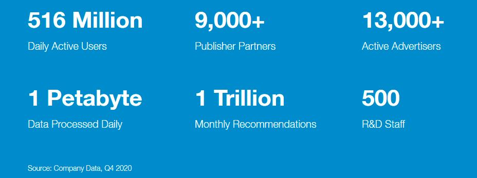
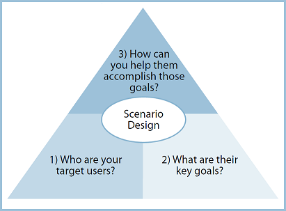

```{r setup}
library(knitr)    # For knitting document and include_graphics function
library(png) 

```
\n

### TABOOLA - POWERING RECOMMENDATIONS FOR THE OPEN WEB - [taboola.com](http://www.taboola.com "taboola.com HOMEPAGE")

```{r fig_1, echo=FALSE, fig.align="center", fig.width=2}
# Small fig.width


```

\n


## ---------------------------- About Taboola ----------------------------------------

\n


#### **Taboola is an AI driven recommendations platform** and is leveraged by over **9,000** digital property owners, including CNBC, NBC News, BILD, Sankei, Business Insider, The Independent, and El Mundo. Over **13,000** advertisers used Taboola to reach **516 million** daily active users in a brand safe environment during Q4 2020.


```{r fig_2, echo=FALSE, fig.align="center", fig.width=2}
# Small fig.width



```
\n


## ---------------------How does Taboola work ---------------------------------------
\n


## Taboola provides the recommender engine for ad content on many of the sites we visit every day
\n

```{r fig_3, echo=FALSE, fig.align="center", fig.width=2}
# Small fig.width


```

### Taboola is responsible for billions of daily recommendations which are powered by an advanced predictive engine that analyzes hundreds of real-time signals (including geography, context, device, social media trends, and more), in order to create a match between the content and the audience most likely to engage with it

\n

### Revenue generated from sponsored items are shared with publishers, who can integrate Taboola across virtually any online destination, from desktop websites to mobile apps to email newsletters. These implementations can be customized to match the UI of the surrounding webpage

\n

# -------------------  Scanario Design Analysis of Taboola  -----------------------------


```{r fig_4, echo=FALSE, fig.align="center", fig.width=2}
# Small fig.width



```
\n


## ------ **TARGET USERS**

Taboola's target users are ultimately any user who clicks on the landing page of any of the company's publishing partners.These include many of the well know sites we use for news such as msn.com, bloomberg.com and the weather channel.

\n

On the other side of that equation Taboola partners with digital content adverisers and bussinesses who are direct advertisers of their products and services to bring that content to the web via their publishing partner network 

\n


## ------ **KEY GOALS**


### **Maximizing RPM**


The key metric that drives Taboola business is **RPM** - Revenue Per million or Revenue Per 1000 recommendations. **This indicates how much money and value we create for our customers on both sides of the equation -  publishers and advertisers**

\n


## ------ **Insights to help Taboola achieve its' goals**

### Taboola is currently leveraging two cutting edge technologies to maximize the efficiency with which it is providing value to its' customers 

**AI and ML** This includes a proprietary loyalty score built on deep learning and AI, which helps segment readers based on attributes such as how frequently they visit, how many pages they visit and how recently they visited - Publishers can then use Taboola to deliver the ideal reader experience to each reader segment, which can both promote increased readership and unlock new monetization options

**NATIVE ADS** Native advertising is the concept of creating ads that are so cohesive with the page content, assimilated into the design, and consistent with the platform behavior that the viewer feels the ad belongs there


### **Making a difference**
Since Taboola is a middle-man entity between web sites (publishers) and advertisers, work to improve their market efficiency has to be done at the AI/ML level and in their Native ADS technologies to improve their performance on both sides. **Developing new algorithms and Ad placement technologies will be areas where a fresh mind can provide impactful contributions**

\n


# -------------------------------------------------------------------------------------------------------------

\n


### Major social platforms, from Facebook to Twitter to Pinterest, monetize their sites with native ads, and Taboola Feed allows publishers of all sizes to tap into the rapidly growing budgets that brands are allocating towards online content promotion.

\n


----------------------------------------------------------------------------------------------------------------

### Source

[taboola.com](http://www.taboola.com "taboola.com HOMEPAGE")
